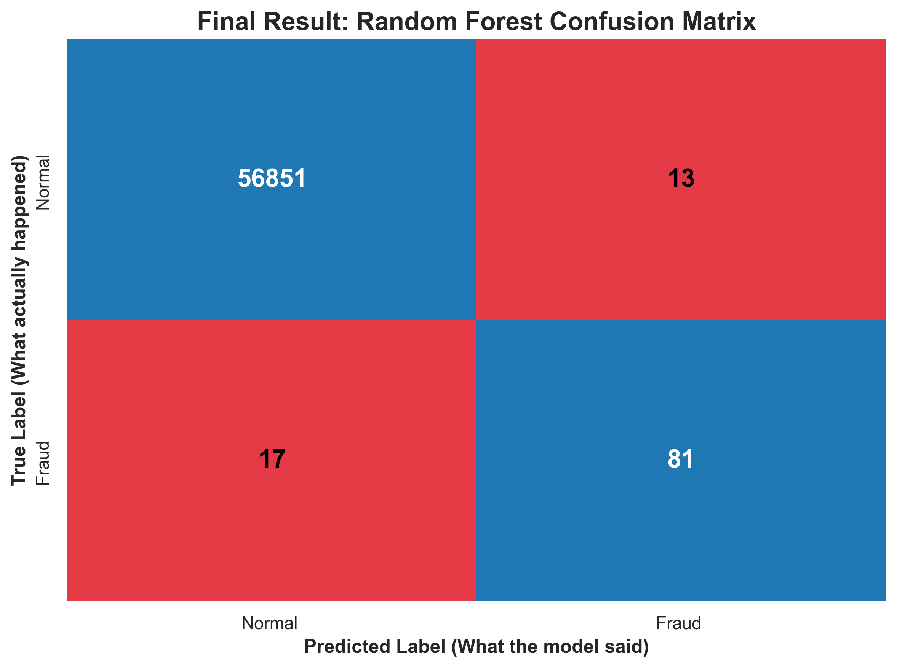
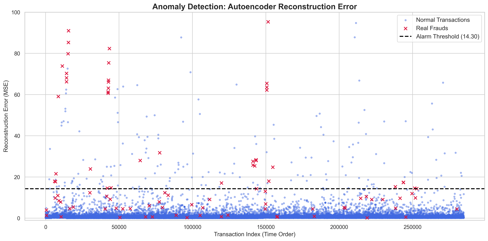

#  Credit Card Fraud Detection System

## Project Overview
This project focuses on using machine learning to detect fraudulent credit card transactions. The main challenge of the dataset used is its large imbalance (frauds account for just ~0.17% of all transactions). 

The goal was to build a model that maximizes the detection of actual frauds and at the same time ensuring a pleasant experience for bank customers.

## Techniques & Tools Used
* **Data Preprocessing:** Handled features hidden via PCA, normalized `Time` and `Amount` using `RobustScaler` to mitigate the impact of extreme outliers.
* **Supervised Learning** Using the Random Forest method combined with 'fake' fraud transaction using SMOTE increased performance of the system.
* **Unsupervised Learning:** Designed an autoencoder **neural network** using TensorFlow for anomaly detection based on reconstruction error.
* **Libraries:** `pandas`, `scikit-learn`, `imblearn`, `tensorflow`, `matplotlib`, `seaborn`.

##  Final Results (Random Forest + SMOTE)
)
  
  The supervised model achieved excellent results, successfully identifying the vast majority of fraudulent activities without overwhelming the system with false positives.

* **True Negatives (Normal passed):** 56,851
* **True Positives (Frauds caught):** 81
* **False Positives (False alarms):** 13
* **False Negatives (Frauds missed):** 17

## Autoencoder Anomaly Detection

As an alternative approach, an unsupervised Autoencoder was trained strictly on normal transactions. By setting a hard threshold at the 99.6th percentile of the mean squared error reconstruction loss, the model successfully flagged anomalies without ever "seeing" a fraud case during training, but didn't perform as well as 
Random Forest.

##  How to Run
1. Clone this repository.
2. Download the dataset from [Kaggle](https://www.kaggle.com/datasets/mlg-ulb/creditcardfraud) and place `creditcard.csv` in the root directory.
3. Install dependencies: `pip install -r requirements.txt`.
4. Run the Jupyter Notebook `fraud_detection_project.ipynb`.
